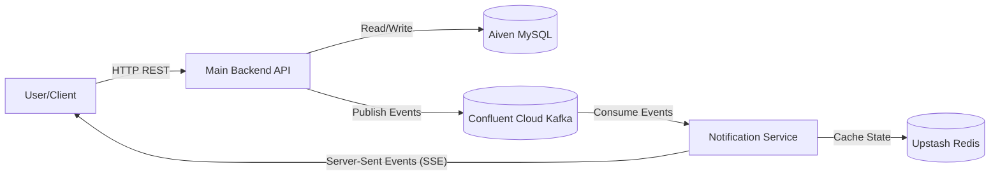

# 🚗 Dynamic Pricing & Management System for Parking Lots


A production-grade, full-stack microservices application designed to manage parking facilities, track vehicles, and calculate parking fees dynamically based on duration and real-time lot occupancy.

The system features an **Event-Driven Architecture**, pushing live updates to the frontend without page refreshes using Server-Sent Events (SSE).

---

## 🔗 Live Demo
### [🌐 Access the Parking Dashboard](https://parking-system-frontend-t9wu.onrender.com/)
*(Hosted on Render. Please allow approx 30-50s for the free-tier services to wake up)*

---

## 🏗️ System Architecture

The application uses a separated command-query flow facilitated by Apache Kafka.



1.  **Command Flow (User Action):** The Angular Frontend sends HTTP requests (Entry/Exit/Create Lot) to the **Main Backend**.
2.  **Persistence:** The Main Backend validates logic, persists data to **MySQL**, and acts as a **Kafka Producer**.
3.  **Event Stream:** 'Vehicle Entry' or 'Lot Update' events are published to specific Kafka topics.
4.  **Notification Flow:** The **Notification Service** consumes these events. It updates the **Redis** cache (for quick state retrieval) and pushes the data immediately to connected clients via **SSE**.
5.  **Real-Time UI:** The Angular Signals in the frontend automatically update the view (Ticket/Bill generation, Slot Counts, Tables) with zero manual refreshing.

---

## 🛠️ Technology Stack

| Domain | Technology / Service |
| :--- | :--- |
| **Frontend** | Angular 21, TypeScript, Angular Material, RxJS |
| **Main Backend** | Java 24, Spring Boot 3, Spring Data JPA, Hibernate |
| **Real-Time Service**| Java Spring Boot, SseEmitter (Server-Sent Events) |
| **Database** | MySQL (Hosted on **Aiven**) |
| **Message Broker** | Apache Kafka (Hosted on **Confluent Cloud**) |
| **Caching** | Redis (Hosted on **Upstash**) |
| **Hosting** | **Render** (Containerized Deployments) |

---

## 📦 Repository Structure

The project is organized as a monorepo containing three distinct services:

```bash
.
├── parking-system-backend/        # Main Business Logic (REST API, MySQL)
├── notification-service/          # Real-time Update Handler (Kafka Consumer, SSE)
├── parking-system-frontend/       # Client UI (Angular)
└── README.md                      # Project Overview (You are here)
```

Each folder contains its own `README.md` with specific setup instructions and environment configuration.

---

## 💡 Key Features

### 1. Operational Management
*   **Vehicle Entry:** Generates a ticket with an allocated slot. Uses **Pessimistic Locking** to ensure two cars are never assigned the same slot simultaneously.
*   **Vehicle Exit:** Generates a bill. Uses **Optimistic Locking** to prevent double-billing.
*   **Lot Management:** Admin interface to create new lots or increase capacity.

### 2. Dynamic Pricing Engine
Bills are calculated based on logic defined in the Main Backend:
*   **Free Tier:** First 30 mins are strictly free.
*   **Base Rate:** Hourly billing (rounded up).
*   **Surge Pricing:** Multipliers applied based on lot occupancy at exit time:
    *   `<50%` Full: **1.0x**
    *   `50-80%` Full: **1.25x**
    *   `>80%` Full: **1.5x**

### 3. Real-Time Dashboard
*   **Live Availability:** Slot counters update instantly across all active users.
*   **Live Sessions:** New entries/exits appear in the monitoring table immediately.
*   **Visual Feedback:** Tickets and Bills pop up dynamically via Toast notifications and on-screen cards.

---

## 6. Assumptions
# Backend

* **Unique Identity**: A Vehicle Number (License Plate) is the unique identifier for a vehicle. Two different physical vehicles cannot have the same number.
* **Single Active Session**: A specific vehicle can only have one **ACTIVE** parking session at a time. It cannot enter a second lot if it hasn't exited the first.
* **Slot Allocation Strategy**: Slots are assigned on a **First-Available-Basis** (e.g., Slot 1, then Slot 2). Drivers cannot choose specific slot numbers manually.
* **Uniform Slot Size**: For this version, we assume all slots in a specific Parking Lot are of uniform size and can accommodate the accepted vehicle types (**CAR**/**BIKE**).
* **Entry/Exit Atomicity**: A vehicle is considered "Entered" only when a Ticket is successfully generated. It is considered "Exited" only when a Bill is generated.
* **Base Price Fluctuation**: If the Base Price of a lot is changed by an admin while a car is parked, the new price is applied at the time of exit (**Dynamic Pricing**).
* **Occupancy Multiplier**: The "Surge Pricing" multiplier (**1.0x**, **1.25x**, **1.5x**) is determined based on the lot's occupancy at the exact moment of exit, not the average occupancy during the stay.
* **Free Tier**: The first 30 minutes are strictly free (₹0 bill). Even 30 minutes and 1 second triggers billing.
* **Rounding Logic**: After the free tier, billing is done per hour or part thereof (e.g., 61 minutes = 2 hours billed).
* **Slot Scaling**: When updating a Parking Lot, the total number of slots can only be increased, not decreased. This prevents the accidental deletion of slots that might currently be occupied.
* **Input Normalization**: The system assumes vehicle numbers may be entered with spaces or lowercase letters but processes them as **Uppercased** and **Stripped** of Special Characters (e.g., "mh 12" -> "MH12").
* **Vehicle Types**: Only **CAR** and **BIKE** are currently supported. Adding a truck or bus would require code changes.
* **Data Persistence**: History is never deleted. Even after a vehicle exits, the `ParkingSession` record remains in the database with status **COMPLETED** for audit purposes.
* **Pessimistic Locking (Entry)**: We assume high contention for slots. **Pessimistic Write Locks** are used during entry to ensure two vehicles never grab the same slot ID simultaneously.
* **Optimistic Locking (Exit)**: We assume valid exits are the norm. **Optimistic Locking** (`@Version`) is used to prevent "Double Billing" if two exit requests for the same car hit the server simultaneously.
* **System Time**: The application relies on the **Server's Local Time** for all calculations. It assumes the database and application server are time-synced.
* **Database Availability**: The system assumes a continuous connection to the **MySQL** database. No offline-mode or local caching logic is implemented.
* **Sequential IDs**: Slot numbers are generated sequentially (**1 to N**) based on the total capacity configured.
* **Update Integrity**: An Admin cannot change the ID or Location of a Parking Lot once created, only its Name, Price, and Capacity (Upwards).

# Frontend
* **Backend Dependency**: The frontend assumes the Spring Boot backend is always running and accessible at `http://localhost:8080`. There is no offline mode or caching mechanism for API failures.
* **Single-operator Interface**: The UI is designed as a single-operator dashboard. It assumes the same person handles both Entry and Exit operations, which is why both forms are displayed side-by-side on the main screen.
* **Client-Side Filtering**: The "Search" and "Date Filter" features on the **Sessions** page perform filtering in the browser memory. It assumes the dataset size (number of parking sessions) is manageable for a web browser (e.g., < 10,000 records) and does not require server-side pagination for search.
* **No Authentication**: The frontend assumes a trusted environment (e.g., an internal company network). There is no Login/Logout functionality; the application loads directly into the operational dashboard.
* **Input Sanitation**: The UI assumes users might input messy data (lowercase, spaces, special chars). It proactively sanitizes vehicle numbers (auto-uppercasing, removing non-alphanumeric chars) **before** sending them to the backend.
* **Timezone**: All timestamps received from the backend (UTC or Server Time) are displayed using the **Browser's Local Timezone**.
* **Visual Feedback**: The application assumes that users prefer ephemeral feedback. Success messages (Tickets/Bills) and Error messages automatically disappear after a few seconds to keep the interface clean for the next transaction.
* **Styling Philosophy**: The project assumes a "Pure CSS" approach is preferred over heavy UI libraries (like Angular Material or Bootstrap) to keep the bundle size small and demonstrate core CSS skills.
---

## Getting Started

Follow these instructions to get both the backend and frontend applications running on your local machine.

### Prerequisites

You must have the following software installed:
-   **Git:** For cloning the repository.
-   **Java Development Kit (JDK):** Version 17 or later.
-   **Apache Maven:** For building and running the backend.
-   **Node.js:** Latest LTS version is recommended.
-   **Angular CLI:** Install globally using `npm install -g @angular/cli`.

### Installation & Running

#### 1. Clone the Repository
Clone this repository to your local machine.

```sh
git clone  https://github.com/devenn05/Dynamic-Parking-System.git
cd dynamic-parking-system
```

## 🚀 Getting Started (Local Development)

To run the entire suite locally, you will need **Java 17+**, **Node.js**, and an instance of **Kafka** & **MySQL** (local or cloud).

### 1. Configure Services
You must configure `application.properties` in both backends to point to your DB and Broker. 
*See specific sub-directory READMEs for detailed Env Variables.*

### 2. Run Main Backend
```bash
cd parking-system-backend
mvn spring-boot:run
# Runs on localhost:8080
```

### 3. Run Notification Service
```bash
cd notification-service
mvn spring-boot:run
# Runs on localhost:8081
```

### 4. Run Frontend
```bash
cd parking-system-frontend
npm install
ng serve
# Runs on localhost:4200
```
---

## Detailed Documentation

For more specific details about each part of the project, please refer to their individual README files:

-   **Backend Documentation:** [**./backend/README.md**](./backend/README.md)
    -   (Includes API endpoint list, pricing logic in detail, and backend setup.)
    **Notification Service Documentation:** [**./notification-service/README.md**](./notification-service/README.md)
    -   (Includes API endpoint list, kafka and Redis setup.)
-   **Frontend Documentation:** [**./frontend/README.md**](./frontend/README.md)
    -   (Includes descriptions of screens, components, and frontend setup.)
